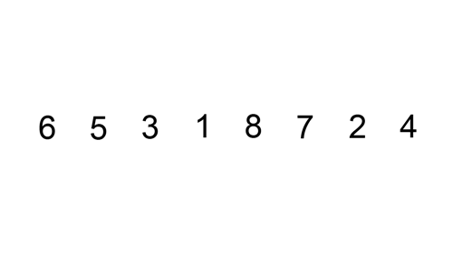
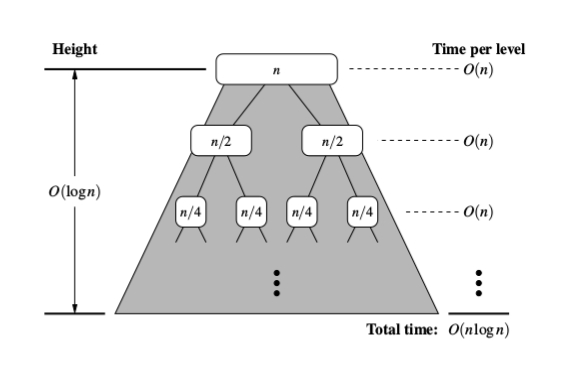

# Unit Challenge: TypeScript

## Overview

Building on your prior experience writing algorithms in JavaScript, the challenges in this repository will serve as your introduction to [TypeScript](https://www.typescriptlang.org/docs/handbook/typescript-in-5-minutes.html), the statically-typed superset of JavaScript that's established itself as the modern industry standard.

As a compiled language, usage of TypeScript goes hand in hand with usage of the TypeScript compiler which most engineers will run via the CLI, running `tsc` in the terminal. By default, running the compiler will type check your project, outputting any errors or warnings to the terminal before attempting to transform your TypeScript into JavaScript. However, its just as common to use tsc in "noEmit" mode in order to perform type checking _without_ outputting/emitting the compiled JavaScript. (Take a look at `tsconfig.json` in this repository to see that this project is configured in precisely that way.)

Modern IDEs take this one step further. Through interfacing with the [TypeScript language server](https://github.com/typescript-language-server/typescript-language-server), VSCode can continuously type check your project in the background without requiring you to explicitly run `tsc` in the terminal. This is why you might see red/yellow squiggly underlines in your IDE, alerting you to any errors caught by the TypeScript compiler, _before you even run your code_!

## Getting Started

- [ ] Fork and clone this repository. If you need a refresher, just follow the instructions found [here](https://github.com/CodesmithLLC/dev-environment-setup/blob/main/fork-clone.md)!

- [ ] Run `npm install` to install any dependencies

NOTE: When TypeScript was first introduced, runtimes like Node.js didn't have the capability to natively run .ts files and *required* developers to first compile to JavaScript, *then* run the output .js file. Recent versions of Node.js now have no trouble at all running TypeScript files, but that doesn't mean that they're running the TypeScript compiler behind the scenes. Instead, most runtimes implement "type-stripping", intelligently removing the type annotations before running the code as plain JavaScript. This provides you all the benefits of strict typing in development while still letting you run .ts files "natively" with no setup required.

## Testing

You can find pre-written tests for this unit in the `tests/` folder. You shouldn't need to edit any of these files, but feel free to take a look at the assertions there when debugging your algorithms. We're using [Vitest](https://vitest.dev/) as our test runner, which you can run from your terminal with `npm test [filename]`. (You can include the file extension, though it's not necessary.)

For example, if you've written your `palindrome` function in Part 1 and want to test that it works correctly, run `npm test palindrome` from this repository's root directory to run the Vitest test suite for that algorithm. (This works because there's a file in the `tests/` directory called `palindrome.test.ts`.) Alternatively, just run `npm test` to run entire suite of automated tests.

## PART 1

- [ ] Complete the algorithms in `src/part-1.ts`, making sure to add any necessary typing. Pay close attention to any type errors and make sure you address any red squiggly underlines or alerts in the diagnostic pane.

## PART 2

Good news! The algorithms in Part 2 have already been completed, but alas, their typing leaves much to be desired.

- [ ] Fix the type errors in `src/part-2.ts`.

## PART 3

- [ ] Complete the sorting algorithms in `src/part-3.ts`, using the information on each approach below to govern the internal sorting logic for each.

### Insertion Sort: `O(n^2)`

Insertion sort reflects the most "human" approach to sorting, as this approach tends to be how we'd tackle sorting numbers in real life. Like bubble sort, insertion sort also assembles a sorted array one element at a time. It takes the next item in the unsorted portion of the array and places it in its correct position within the sorted portion of the array.

### Bubble Sort: `O(n^2)`

Bubble sort is terribly inefficient, but it has a charming name and is probably the most intuitive. It iterates through the array as many times as needed; it knows to stop once no more changes need to be made (i.e. when the array is sorted). At each iteration, it swaps neighboring elements if they are out of order, and essentially "bubbles" one (biggest, unsorted) element to its correct position.

### Merge Sort: `O(n * log(n))`

Merge sort is a recursive, "divide-and-conquer"-style algorithm. It recursively splits the array into two halves and merges them back together in sorted order. Since it is done recursively, the array is broken down until each element is in its own individual array. Then, a helper function creates and merges pairs of these one-element arrays so that there is a collection of sorted two-element arrays. These are then merged in pairs, and so on, until all the elements have been pieced back together into one fully sorted array.

Merge sort has a time complexity of `O(nlogn)`, which is more performant and less expensive than `O(n^2)`. The below image should help provide context as to how merge sort's overall time complexity reduces to `O(nlogn)`.

### BONUS

These bonus objectives are opportunities to extend your learning beyond the base challenges. They can be attempted in any order, depending on what you want to focus on.

- [ ] Complete the algorithms in `src/part-4.ts`.

- [ ] Complete the algorithms in `src/part-5.ts`.
